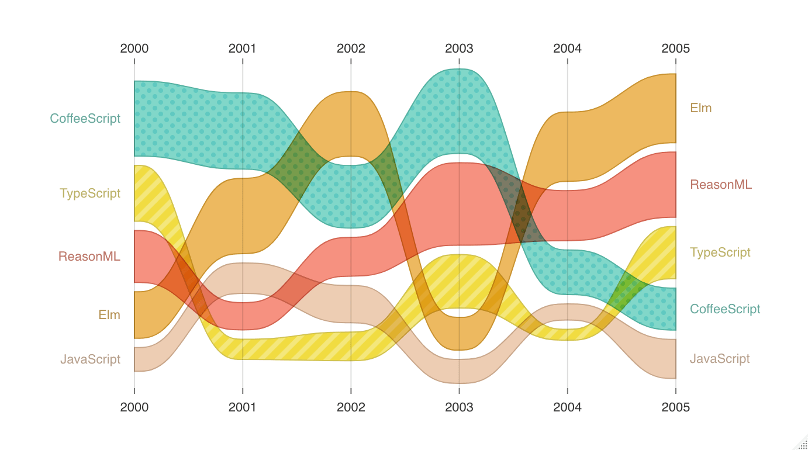

<!-- README.md is generated from README.Rmd. Please edit that file -->

```{r, include = FALSE}
knitr::opts_chunk$set(
  collapse = TRUE,
  comment = "#>",
  fig.path = "man/figures/README-",
  out.width = "100%"
)
```

# nivor

<!-- badges: start -->
[](https://CRAN.R-project.org/package=nivor)
[](https://codecov.io/gh/swsoyee/nivor?branch=main)
[](https://github.com/swsoyee/nivor/actions)
[](https://www.tidyverse.org/lifecycle/#experimental)
<!-- badges: end -->

The goal of nivor is to ...

## Installation

You can install the released version of nivor from [CRAN](https://CRAN.R-project.org) with:

``` r
install.packages("nivor")
```

## Example

This is a basic example which shows you how to solve a common problem:

### AreaBump

```{r AreaBump, eval=FALSE}
data <- data.frame(
  year = 2000:2005,
  JavaScript = runif(6, min = 0, max = 50),
  ReasonML = runif(6, min = 0, max = 50),
  TypeScript = runif(6, min = 0, max = 50),
  Elm = runif(6, min = 0, max = 50),
  CoffeeScript = runif(6, min = 0, max = 50)
)

# the simplest use
n_area_bump(data)
```



### Calendar

```{r calendar, eval=FALSE}
library(nivor)

df <- data.frame(
  day = seq.Date(
    from = as.Date("2020-04-01"),
    length.out = 600,
    by = "days"
  ),
  value = round(runif(600) * 1000, 0)
)

# the simplest use
n_calendar(df)
```


## Code of Conduct

Please note that the nivor project is released with a [Contributor Code of Conduct](https://contributor-covenant.org/version/2/0/CODE_OF_CONDUCT.html). By contributing to this project, you agree to abide by its terms.
